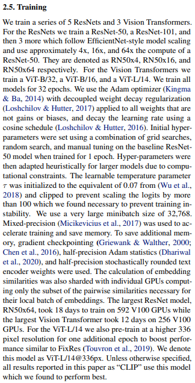

# train-CLIP 📎

A PyTorch Lightning solution to training CLIP from both scratch and fine-tuning.

### 注意：需要安装openAI的clip的依赖 https://github.com/openai/CLIP
### 其他缺少的包版本请参照requirements.txt
### 预训练权重(.ckpt文件）请从24服务器下载，速度更快： /workspace/DATA/xpj/model/ 在46服务器也存放了模型权重：/workspace/xpj/model/
### 加载预训练权重请参考load_chekpoint.py 或 load_chekpoint_new.py 内容一样的 注意预训练模型和微调模型加载方式不同，一个是CLIP 一个是CLIPWrapper

---
### 如果要用train_finetune_vpt.py 请提前准备好数据集 

格式：二级目录，一级目录为yourdataset,二级目录为img,text,npz,二级目录下的内容为各个类型的文件

|-- yourdataset/ <br>
|   |-- img/ <br>
|   |   |-- image1.jpg <br>
|   |   |-- image2.jpg <br>
|   |   |-- ... <br>
|   |-- text/ <br>
|   |   |-- text1.txt <br>
|   |   |-- text2.txt <br>
|   |   |-- ... <br>
|   |-- npz/ <br>
|   |   |-- data1.npz <br>
|   |   |-- data2.npz <br>
|   |   |-- ... <br>

运行命令<br>
````
python train_finetune_vpt.py --model_name ViT-L/14 --folder /your/dataset/folder/ --batch_size 26
````

---

---
## Usage 🚂

### From Scratch 🌵
This training setup is easily usable right outside the box! Simply provide a training directory or your own dataset and we've got the rest covered. To train a model just specify a name from the paper name and tell us your training folder and batch size. All possible models can be seen in the yaml files in `models/config`

```
python train.py --model_name RN50 --folder data_dir --batchsize 512
```

### Data-Efficient Finetuning 🚆
To perform CLIP training much more efficiently, you might be interested in the class `CustomCLIPWrapper`. This functions as a way to finetune pre-trained image and language models; in turn this leads to a large performance efficiency increase! In order to use this, one simply needs to modify the `train_finetune.py` file to pass an image encoder and Hugging Face text encoder. 

```python
img_encoder = resnet50(pretrained=True)
img_encoder.fc = torch.nn.Linear(2048, 768)

tokenizer = AutoTokenizer.from_pretrained("johngiorgi/declutr-sci-base")
txt_encoder = AutoModel.from_pretrained("johngiorgi/declutr-sci-base")

model = CustomCLIPWrapper(img_encoder, txt_encoder, hparams.minibatch_size, avg_word_embs=True)
```

The command line argument is the same as before minus the `--model_name` flag:
```
python train.py --model_name RN50 --folder data_dir --batchsize 512
```

### Training with our DataModule 📉

As long as each of the image pairs have the same stem name (i.e. `coco_img1.png` and `coco_img1.txt`) all that you need to do is specify the folder on runtime. Any subfolder structure will be ignored, meaning `foo/bar/image1.jpg` will always find its `myster/folder/image1.txt` so long as they share a common parent folder. All image suffixes will work, the only expectation is that captions are separated by `\n`.

### Traing with you own Data 📊

If you have different training needs you may drop in your very own DataLoader. Edit the `train.py` script to you needs by commenting out our DataModule and inserting your own into `trainer.fit(model, your_data)`. The only expectation is that the first item of the return tuple is the image batch, and the second is the text batch.

## Goal ⚽

Our aim is to create an easy to use Lightning implementation of OpenAI's clip training script. We want our end product to be as inline with the orignal paper as possible. We will live by:

<p align="center">
    
</p>

## Citing

To cite this exact repo feel free to use:
```
@misc{cg2021trainCLIP,
  author = {Cade Gordon},
  title = {train-CLIP},
  year = {2021},
  publisher = {GitHub},
  journal = {GitHub repository},
  doi = {10.5281/zenodo.4915843},
  howpublished = {\url{https://github.com/Zasder3/train-CLIP}}
}
```

Learning transferable visual models from natural language supervision (a.k.a. CLIP)
```
@article{radford2021learning,
  title={Learning transferable visual models from natural language supervision},
  author={Radford, Alec and Kim, Jong Wook and Hallacy, Chris and Ramesh, Aditya and Goh, Gabriel and Agarwal, Sandhini and Sastry, Girish and Askell, Amanda and Mishkin, Pamela and Clark, Jack and others},
  journal={arXiv preprint arXiv:2103.00020},
  year={2021}
}
```

Data-Efficient Language-Supervised Zero-Shot Learning with Self-Distillation
```
@article{cheng2021data,
  title={Data-Efficient Language-Supervised Zero-Shot Learning with Self-Distillation},
  author={Cheng, Ruizhe and Wu, Bichen and Zhang, Peizhao and Vajda, Peter and Gonzalez, Joseph E},
  journal={arXiv preprint arXiv:2104.08945},
  year={2021}
}
```

## TODO ✅

- [x] Get OpenAI's model creation script
- [x] Create model inits
  - [x] ResNet50
  - [x] ResNet50x4
  - [x] ResNet101
  - [x] ViT-B/32
  - [x] all models
- [x] Create model wrapper
- [x] Create lightning trainer
- [x] Create dataset files 
- [ ] Performance boosts
  - [x] Mixed-precision
  - [x] Self-distillation
  - [ ] Gradient checkpointing
  - [ ] Half-precision Adam statistics
  - [ ] Half-precision stochastically rounded text encoder weights
